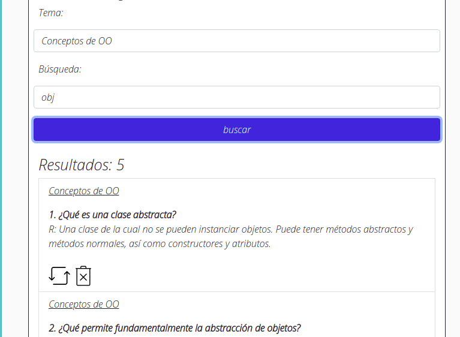

# Ingeniería de Software

1. Introducción 
2. El Lenguaje de Modelación Universal (UML) 
3. Planeación del Sistema de Programación
4. Diseño
5. Introducción a la Investigación de Operaciones 
6. Sistemas Críticos
7. Verificación y Validación 
8. Administración
9. Evolución y Tendencias 

# Quizzes

{ width=50% } { width=50% }
